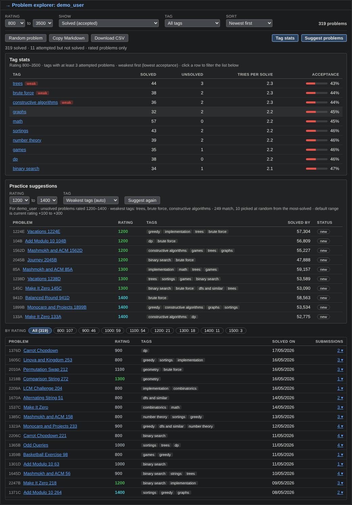

# CF Problem Explorer

A Chrome extension that adds a **problem explorer** to every Codeforces profile page. Pick a rating and see the problems that user solved, tried, or still needs to upsolve. It works on **any** profile, not only your own, so you can also use it to find practice problems from a friend's history.



> The screenshot above uses sample data. Replace it with a real screenshot of your own profile.

## Features

- **Filter by rating range** (for example 900 to 1200), with clickable chips showing how many problems exist at each rating.
- **Four views** in the Show dropdown:
  - Solved (accepted)
  - Attempted, not solved
  - Upsolve queue: problems tried during a contest that were never solved
  - Solved by them, not by me: problems a friend solved that you have not (needs you to be logged in; hidden on your own profile)
- **Filter by tag** and **sort** by date or rating.
- **Submission history**: expand any problem to see every submission with verdict, language and time, linked to the submission page.
- **Tag stats**: solved, unsolved, tries per solve and acceptance rate per tag, with the weakest tags flagged. Click a tag to filter the list.
- **Practice suggestions**: unsolved problems around your level (current rating +100 to +300), focused on your weakest tags, with a "Suggest again" button.
- **Random problem** from the current list.
- **Export** the current list as a Markdown table or a CSV file, handy for sharing a practice sheet.
- Follows the page theme, including dark mode.

## Install

The extension is not on the Chrome Web Store yet, so load it manually:

1. Download this repository (**Code**, then **Download ZIP**) and unzip it, or run `git clone https://github.com/kashyapanand21/cf-problem-explorer.git`.
2. Open `chrome://extensions` in Chrome (or Edge, Brave, or another Chromium browser).
3. Turn on **Developer mode** (top right).
4. Click **Load unpacked** and select the folder that contains `manifest.json`.
5. Open any profile, for example `https://codeforces.com/profile/tourist`. The explorer appears just below the activity heatmap.

To update later, replace the files, click the refresh icon on the extension in `chrome://extensions`, and hard-reload the Codeforces tab.

## How it works

The extension only reads data from the public [Codeforces API](https://codeforces.com/apiHelp):

| Endpoint | Used for |
| --- | --- |
| `user.status` | the profile owner's submissions (and yours, for the "not by me" view) |
| `problemset.problems` | the full problem list, only when you open Suggest problems |
| `user.info` | the profile owner's current rating, for the default suggestion range |

Requests are spaced about 2 seconds apart to respect the API rate limit, and results are cached in the tab's `sessionStorage` for 10 minutes so changing filters does not refetch.

## Privacy and permissions

- The only host permission is `https://codeforces.com/*`, and the script only runs on profile pages.
- No data is collected, stored on a server, or sent anywhere except to the Codeforces API itself.
- Nothing is saved beyond the 10-minute cache in your browser tab.

## Limitations

- Problems without a rating (most gym problems, and some old problems) are skipped, because they cannot match a rating filter.
- Practice suggestions are for the profile you are viewing. On a friend's profile they are suggestions for that friend.
- Gym problems are not suggested, because Codeforces does not include them in its problem list.
- The card is placed relative to the activity heatmap. If Codeforces changes its page layout, the position may need a small fix.
- Tested in Chromium-based browsers only.

## Project structure

```
manifest.json   extension manifest (Manifest V3)
content.js      all of the logic and UI, injected into profile pages
screenshots/    images used in this README
```

There is no build step. Edit `content.js`, refresh the extension, and reload the page.

## Contributing

Issues and pull requests are welcome. If you report a bug, please include the profile handle (or a screenshot) and anything shown in the browser console (F12).

## License

[MIT](LICENSE)

This project is not affiliated with or endorsed by Codeforces.
